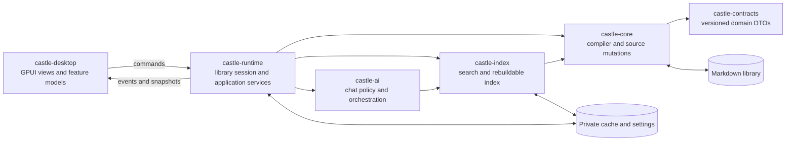
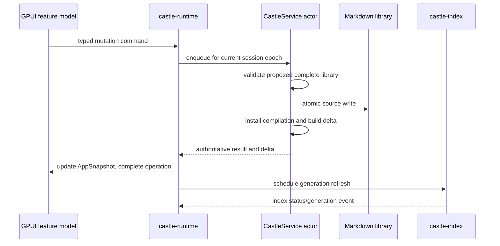

# GPUI desktop migration architecture

Status: accepted; Milestone 0 implementation in progress
Target: replace Castle's Electron desktop application with a native Rust and GPUI application  
Web target: remains the existing React application

## Purpose

The GPUI prototype proves that Castle's shell and Library can be expressed as a
native application without losing the product's visual character. This document
turns that prototype into an incremental migration plan for the complete desktop
product.

The migration is not a second content engine. Markdown remains the source of
truth, `castle_core` remains the authority for compiling and mutating a library,
and `castle_index` remains the owner of the rebuildable local index. The new work
is primarily a native application layer and a GPUI presentation layer.

## Decisions

1. **Only the desktop UI is being replaced.** The static web application keeps
   React, Vite, and its read-only platform implementation.
2. **The desktop calls Rust in-process.** GPUI must not spawn `castle daemon` or
   introduce a JSON bridge for ordinary desktop operations. The daemon stays
   available for the CLI and other process-boundary consumers.
3. **One library session owns mutable content state.** All source mutations and
   external-file refreshes are serialized by a session actor that owns
   `CastleService`.
4. **The UI consumes authoritative snapshots and deltas.** Views do not read
   Markdown files directly and do not maintain a second domain model.
5. **Navigation paths remain compatible.** Stable paths such as `/library`,
   `/browse/...`, and `/note/...` continue to identify destinations even though
   GPUI uses a typed router internally.
6. **There is no embedded React fallback in the shipped native app.** A feature
   is native, deliberately delegated to the system (for example opening an
   external URL), or not yet part of the native release.
7. **Migration happens in vertical slices.** Electron remains the production
   desktop until the native release satisfies the cutover gates below.
8. **GPUI stays pinned.** Upgrades to the pinned GPUI version are deliberate,
   isolated changes with a shell, input, and rendering regression pass.
9. **macOS is the first supported native target.** Other desktop platforms are
   enabled only after their build, packaging, input, and accessibility gates are
   exercised in CI and on real hardware.

## Invariants

These rules are non-negotiable throughout the migration:

- Source Markdown is the only authoritative knowledge store.
- Every content write goes through `castle_core` validation, revision checks,
  atomic replacement, and rollback behavior.
- `.castle/` settings and caches are per canonical library path and are not
  knowledge backups.
- A stale background result may never update a newly selected library.
- Filesystem, compilation, index, model, network, and media work may not block
  the GPUI thread.
- The web build receives no desktop filesystem or mutation capability.
- Private library content is not sent to an external provider without the
  existing explicit AI privacy policy and audit behavior.
- Feature modules communicate through shared application commands, events, and
  domain selectors rather than importing one another's UI state.

## Target topology



### Rust crates

The accepted prototype has moved into the native workspace and the first
foundation milestone is establishing these stable layers:

```text
native/
  castle_contracts/   Existing versioned domain and mutation types
  castle_core/        Existing compiler, source storage, records, and mutations
  castle_index/       Existing lexical, semantic, and structured queries
  castle_ai/          New provider-neutral chat policy, orchestration, and audit
  castle_runtime/     New long-lived desktop application/session layer
  castle_desktop/     New GPUI executable and native feature views
  castle_cli/         Existing CLI and daemon; not used by castle_desktop
  castle_mcp/         Existing MCP server
  castle_web_build/   Existing static-web generator
```

`castle_ai` can be introduced when AI migration begins; it does not need to be
an empty crate during the early milestones. `castle_desktop` should not be a
default workspace member until desktop dependencies are supported on every
normal native CI runner. It must have its own explicit format, test, clippy,
build, and packaging jobs from the start.

### Dependency rules

- `castle_contracts` depends on no Castle crate.
- `castle_core` may depend on `castle_contracts`, never on runtime or UI code.
- `castle_index` may depend on core and contracts, never on GPUI.
- `castle_ai` may depend on index-facing interfaces and contracts, never on
  GPUI.
- `castle_runtime` composes core, index, AI, preferences, file watching, and
  platform ports. It has no GPUI elements, colors, focus handles, or view state.
- `castle_desktop` depends on runtime and shared domain types. It does not call
  the filesystem or index database directly.
- Native feature views do not import another feature's view or model. Shared
  controls belong under `ui`, and cross-feature data belongs in runtime-backed
  selectors.

These boundaries should be enforced with a small repository architecture check,
equivalent to `scripts/check-architecture.mjs`, once the crates exist.

## Runtime architecture

### Library session actor

`CastleService` is synchronous and already owns the correct validation and
publication rules. Instead of placing it behind a UI-thread mutex, a dedicated
library-session worker owns it and handles one command at a time.

```rust
enum LibraryCommand {
    ReadSource { note_id: String, reply: Reply<SourceDocument> },
    SaveSource { input: SaveSourceInput, reply: Reply<SaveSourceResult> },
    CreateSource { input: CreateSourceInput, reply: Reply<SaveSourceResult> },
    MoveSource { input: MoveSourceInput, reply: Reply<MoveSourceResult> },
    DeleteSource { input: DeleteSourceInput, reply: Reply<DeleteSourceResult> },
    RestoreSource { input: RestoreSourceInput, reply: Reply<SaveSourceResult> },
    MutateTask { input: MutateTaskInput, reply: Reply<TaskMutationResult> },
    RefreshExternalChanges,
    Shutdown,
}

enum RuntimeEvent {
    LibraryReady { epoch: SessionEpoch, snapshot: Arc<AppSnapshot> },
    ContentDelta { epoch: SessionEpoch, delta: CompilationDelta },
    ServiceStatus { epoch: SessionEpoch, status: ServiceStatus },
    IndexStatus { epoch: SessionEpoch, status: IndexStatus },
    SourceChanged { epoch: SessionEpoch, change: SourceChange },
}
```

The names above define the boundary, not a requirement to expose every channel
implementation publicly. The important properties are:

- commands are bounded and typed;
- content writes are serialized;
- expensive work runs off the GPUI thread;
- results carry a monotonically increasing `SessionEpoch`;
- the GPUI store ignores events from an old epoch after library switching;
- shutdown cancels watchers, index work, chat streams, and queued commands.

### State ownership

| State | Owner | Examples |
| --- | --- | --- |
| Authoritative library data | `castle_runtime` snapshot | notes, sections, folders, tasks, projects, events, relationships |
| Source mutation state | library session actor | revisions, trash IDs, compilation and publication |
| Search state | index service | generation, embedding readiness, results |
| Durable UI preferences | runtime preferences service | pins, sidebar mode, list/grid/board choices, hidden tabs |
| Window and navigation state | GPUI app model | route history, active overlay, focus, window geometry |
| Feature interaction state | GPUI feature model | selection, filters, drafts, inspector visibility |
| Rebuildable layout caches | GPUI components | Markdown layout, measured rows, thumbnails |

The initial prototype's `DemoLibrary` copies a simplified compilation into UI
types. That is useful for feasibility but should not become the production
model. Replace it with an `Arc<AppSnapshot>` containing the existing contract
types plus lookup tables built once per generation.

Recommended snapshot indexes include notes by ID and route, notes by section and
directory, tasks/projects/events by ID, backlinks by note, and ordered sidebar
collections. Feature models hold IDs and query parameters, not cloned records.

### Mutation flow



Content edits should be pessimistic by default: show an operation state, apply
the authoritative result, and then render the emitted delta. Small reversible
interface preferences can update optimistically. A feature may use optimistic
domain changes only when it defines and tests rollback and conflict behavior.

### External filesystem changes

The watcher sends a debounced `RefreshExternalChanges` command to the same
session actor. A low-frequency fingerprint scan supplies eventual consistency
if an operating-system notification is coalesced or lost. The actor recompiles
once, publishes a delta or replacement snapshot, and schedules the matching
index generation. It never races a save on a separate `CastleService` instance.

On a compile error, the last valid snapshot stays visible and the runtime emits
a stale status with diagnostics and Retry. This matches the current desktop
behavior without requiring a child-process restart.

### Library switching and startup

1. Load application configuration and the known-library registry.
2. If no usable library is selected, show the native library chooser.
3. Allocate a new session epoch and show the shell immediately in a loading
   state.
4. Register the file watcher before opening the service so no startup edit can
   fall between the initial compilation and watcher subscription.
5. Open `CastleService` on the library worker, publish `LibraryReady`, and open
   or rebuild the local index asynchronously.
6. Restore per-library preferences only after canonicalizing the library path.
7. When switching, increment the epoch before cancelling the previous session.

Failures are explicit app states (`choosing`, `opening`, `ready`, `stale`, and
`unavailable`), not panics. The user must be able to choose another library or
retry without restarting the app.

The foundation now implements runtime switching through GPUI's native directory
picker. Selection retires the active epoch before the previous actor shuts down;
the replacement actor starts off the UI thread, and only its epoch is activated
before its event receiver is attached. Overlapping chooser and switch requests
are suppressed. Persisted recent libraries and the launch-time chooser remain
future work.

## GPUI application architecture

### Suggested source layout

```text
castle_desktop/src/
  main.rs                 App identity, window creation, crash boundary
  app.rs                  Root GPUI entities and runtime subscription
  route.rs                Typed routes, history, deep-link serialization
  actions.rs              Global GPUI actions and key bindings
  theme/
    tokens.rs             Castle color, type, radius, and spacing tokens
    icons.rs              Stable Castle icon identifiers and vector paths
  ui/
    shell.rs              Sidebar, navbar, breadcrumb, workspace slots
    button.rs
    input.rs
    list.rs
    grid.rs
    menu.rs
    overlay.rs
    inspector.rs
    empty_state.rs
    operation_state.rs
  features/
    home/
    library/
    notes/
    search/
    tasks/
    calendar/
    projects/
    people/
    stash/
    canvas/
    sheets/
    playlists/
    ai_chat/
    settings/
```

The prototype theme, route, and epoch-aware `LibraryState` have been separated
from `ui.rs`; the remaining shell and Library view code should be split as the
foundation work continues. Each feature owns:

- its GPUI model and actions;
- pure selectors and presentation structs;
- view composition;
- keyboard and pointer behavior;
- focused tests for selectors, commands, and state transitions.

Reusable visuals move to `ui/` only after at least two features need them.
Domain rules move to core/runtime rather than becoming reusable UI helpers.

### Root entities

- `CastleAppModel`: lifecycle, active session, windows, global overlays.
- `RouterModel`: current typed route, back/forward stacks, redirect handling.
- `LibraryStore`: current `Arc<AppSnapshot>`, service/index status, runtime
  subscription.
- `PreferencesModel`: durable per-library and application preferences.
- Feature models: created per workspace and addressed by stable entity IDs.

GPUI actions, rather than raw global keystroke inspection, should drive commands
and navigation. Text entry must use focused input/editor entities so IME,
selection, clipboard, and accessibility can be handled correctly. The
prototype's lightweight `search_active` keystroke collector is temporary.

### Typed routing

The router should parse and format the existing path vocabulary:

```rust
enum Route {
    Home,
    Library,
    Folder { section: SectionId, directory: Vec<String> },
    Note { note_id: NoteId, anchor: Option<String> },
    People,
    Calendar { date: Option<DateKey> },
    Projects,
    Tasks,
    Sheets { directory: Vec<String> },
    Sheet { relative_path: String },
    Canvas { relative_path: Option<String> },
    NotFound { path: String },
}
```

Modal and panel state—search, settings, AI chat, context menus, inspectors—does
not belong in `Route`. Internal Markdown links and search results resolve to a
typed route before navigation. Route formatting remains covered by shared
golden fixtures so native and web destinations do not drift.

### Castle design system

The native theme should codify the existing Castle/Kantzen decisions already
used by the prototype: near-black canvas and navigation surfaces, square quiet
borders, compact 48/44-pixel chrome, restrained blue accent, uppercase group
labels, and dense information layouts.

Tokens are the only place feature code obtains colors, spacing, typography, or
control heights. Common controls must define hover, active, disabled, focus,
selected, destructive, loading, and error states. Every interactive control
must have a keyboard path, visible focus, accessible label, and appropriate
cursor behavior.

Large libraries require virtualized lists/grids. No feature should render an
unbounded note, task, event, or search-result collection.

## High-risk native surfaces

### Markdown reader

The reader needs a parsed, cached document model rather than one GPUI text node
per raw Markdown line. Cache keys include note revision, available width, theme,
and relevant view settings. The renderer must support headings and anchors,
internal and external links, lists and task lists, tables, code, block quotes,
images, and Castle asset resolution before it replaces Electron reading mode.

Link resolution and asset authorization remain application services. A rendered
note may request navigation or an allowed asset; it may not open arbitrary
filesystem paths.

### Source editor

The editor is a release gate, not a cosmetic text area. Before implementation,
build a focused spike that proves:

- large-document editing without frame stalls;
- IME and composed text;
- Unicode movement and selection;
- clipboard, undo/redo, find, and line navigation;
- dirty-state prompts across navigation and window close;
- accessible focus and screen-reader behavior;
- revision conflict presentation and recovery.

The production editor owns a text buffer and edit history separately from its
view. Save always supplies the revision originally read and lets `castle_core`
detect external changes. Read, Source, and split Edit/Preview modes consume the
same `SourceDocument` session.

### Canvas, maps, sheets, and media

- **Canvas:** port JSON Canvas parsing and mutation rules into testable Rust,
  then build viewport math, selection, connections, and cards on GPUI's drawing
  path. Preserve compatible extension fields and atomic autosave.
- **Relationship graph/map:** reuse existing Rust relationship projections.
  Implement graph layout and hit testing off the UI thread. A geographic map
  needs a separate native tile/cache and attribution design decision.
- **Sheets:** port the ODS archive/parser and calculation model to Rust before
  building the virtualized native grid. Preserve the web implementation until
  shared golden workbooks prove parity.
- **Playlists/video:** native media playback and YouTube embedding need an
  explicit feasibility decision. Opening a source in the system browser is an
  acceptable first native behavior; embedding the existing React feature is
  not.
- **PDFs and external URLs:** use narrow platform services that validate the
  library asset path or URL before delegating to the operating system.

Each surface is independently releasable. None may bypass the runtime's path
containment and privacy policies for convenience.

## Existing responsibility map

| Current owner | Native owner | Migration note |
| --- | --- | --- |
| `electron/main.ts`, preload, security policy | `castle_desktop` bootstrap plus runtime ports | Browser sandbox and IPC disappear; native path/URL boundaries remain |
| `electron/native_service.ts`, content IPC | `castle_runtime` library actor | Call `CastleService` directly and emit typed events |
| `electron/library_location.ts` | runtime library registry/chooser service | Preserve canonical paths and per-library caches |
| `electron/user_preferences.ts` | runtime preferences service | Keep readable atomic `.castle/settings.toml` |
| Electron IPC contracts | direct Rust APIs plus `castle_contracts` | Keep versioned DTOs for web generation, fixtures, daemon, and MCP boundaries |
| `electron/canvas_library.ts` and media library | runtime canvas/media stores | Port validation and atomic file operations |
| `electron/sheet_library.ts` | runtime sheet store | Port archive limits and path checks before UI |
| `electron/ai/*` | `castle_ai` plus runtime stream events | Preserve provider policy, cancellation, citations, and memory-only audit |
| React Router | typed GPUI router | Preserve stable Castle path serialization |
| Kantzen UI and Castle CSS | native theme and `ui/` controls | Match behavior and states, not DOM structure |
| React feature hooks/components | GPUI feature models/views | Promote domain logic to Rust; port presentation by vertical slice |

## Feature migration order

### Milestone 0 — foundation

- Move the prototype to `castle_desktop` and add `castle_runtime`.
- Establish session epochs, background execution, cancellation, and app states.
- Split `ui.rs` into shell, tokens, controls, routing, and Library feature code.
- Add native logging, panic reporting, debug performance counters, and explicit
  desktop CI commands.
- Capture Electron reference screenshots and behavior fixtures for the example
  library.

Exit gate: switching libraries repeatedly cannot display stale content, and no
library compile or filesystem operation occurs on the GPUI thread.

### Milestone 1 — complete read-only Library

- Finish Library list/grid navigation, breadcrumbs, pins, recent notes, and
  view preferences.
- Implement the Markdown reader, table of contents, backlinks, previous/next,
  internal links, assets, and built-in documents.
- Connect lexical search and the command palette through the runtime to
  `castle_index`.
- Implement proper GPUI inputs, focus, menus, shortcuts, and context menus.

Exit gate: every example-library note can be found, opened, navigated, and read
with keyboard-only operation and without raw Markdown fallback.

### Milestone 2 — safe editing and library management

- Native library chooser, recent libraries, retry/stale states, and switching.
- Source editor and preview, create/move/delete/restore notes and folders.
- Built-in document override creation, drag/drop assets, conflict recovery, and
  dirty-close prompts.
- Complete per-library preferences and native window persistence.

Exit gate: the source mutation integration suite passes against temporary
libraries, forced conflicts, failed validation, external changes, and crash-like
interruption points without data loss.

### Milestone 3 — structured workspaces

- Home shortcuts and Castle Actions.
- Tasks including list, groups, kanban, inspector, checklist, delete, and undo.
- Calendar month/week/year/timetable and event editing.
- Projects, Stash, People, relationship hierarchy, graph, and person editing.

Move deterministic Markdown builders and presentation selectors into Rust when
they express shared domain behavior. Keep GPUI-only selection and layout logic
inside each feature.

Exit gate: native and Electron golden fixtures produce equivalent record writes
and projections for tasks, events, projects, people, and stash entries.

### Milestone 4 — document workspaces and media

- Native JSON Canvas editor and media import.
- Native ODS sheet library, calculations, editor, and export.
- Playlist experience and the agreed video behavior.
- Relationship geographic map if it remains a required desktop feature.

Exit gate: representative canvases and workbooks round-trip without losing
supported data, and unsupported media behavior is explicit rather than broken.

### Milestone 5 — search, AI, and desktop polish

- Semantic/hybrid search readiness and progress UI.
- Rust AI chat orchestration, streaming, cancellation, citations, provider
  consent, and audit diagnostics.
- Accessibility audit, localization-safe layout, multi-window decision, menus,
  file-open/deep-link handling, icons, packaging, signing, and notarization.
- Startup, memory, scrolling, input-latency, and large-library profiling.

Exit gate: private-content transmission policy is equivalent to Electron and
all release artifacts pass platform security and packaging checks.

### Milestone 6 — cutover

- Run the complete desktop parity checklist on `examples/library` and at least
  one large, representative private library.
- Perform a recovery rehearsal from invalid Markdown, stale index, unavailable
  model, missing library, external source conflict, and interrupted mutation.
- Change `dev:desktop`, package, and make scripts to the native application.
- Remove Electron runtime dependencies, bridge code, Forge configuration, and
  Electron-only tests only after their native replacements pass.
- Keep the last Electron release tag as the rollback point; do not retain two
  writable desktop applications as ongoing products.

## Verification strategy

### Tests by layer

- **Core/contracts/index:** existing Rust unit and integration suites remain
  mandatory.
- **Runtime:** temporary-library tests for startup, command ordering, watcher
  coalescing, old-epoch rejection, cancellation, failure states, and shutdown.
- **Feature model:** pure tests for selection, filters, navigation, edit state,
  optimistic preference changes, and command generation.
- **Golden parity:** shared JSON/Markdown/canvas/ODS fixtures run through the
  existing implementation and the Rust port while Electron is present.
- **UI behavior:** scripted keyboard/pointer scenarios plus screenshot baselines
  at standard and compact window sizes.
- **Packaging:** launch, library-open, edit/save, relaunch, and asset loading from
  the signed packaged artifact—not only `cargo run`.

The current unbundled debug binary has no registered macOS application identity,
so accessibility-driven UI automation cannot address it by bundle ID. Packaging
must establish that identity before the native picker and other system surfaces
can join the scripted UI suite; process and runtime integration smoke tests cover
the development binary in the interim.

### Performance rules

Milestone 0 records reference-library and large-library baselines. CI should
then detect regressions in compile/open time and snapshot size. Debug builds
should log any synchronous GPUI callback exceeding one frame (16 ms), with an
8 ms warning threshold. Long lists must demonstrate bounded rendered-row counts,
and all background operations need cancellation or stale-result suppression.

### Data-safety gate

No feature is considered migrated because it looks complete. A writable feature
is complete only when tests cover successful writes, rejected validation,
revision conflict, external modification, rollback, undo/trash when applicable,
and restart from the resulting files.

## Cutover definition

Electron can be removed when all of the following are true:

- every desktop route has a native implementation or an explicitly approved
  product-level replacement;
- editing and structured mutations meet the data-safety gate;
- search, AI privacy, preferences, library switching, assets, and external-file
  refresh meet their parity checks;
- keyboard, focus, IME, clipboard, accessibility, and large-library behavior
  pass on the supported operating systems;
- signed release artifacts pass clean-machine smoke tests;
- the static web build and deployment remain unchanged and green;
- no production native path invokes Electron, Node, a renderer bundle, or an
  embedded React compatibility surface.

## Immediate execution backlog

The next implementation slice should establish the foundation before adding
more screens:

- [x] Create `castle_runtime` with `SessionEpoch`, `AppSnapshot`, typed commands,
  runtime events, and a serial `CastleService` worker.
- [x] Move the GPUI crate to `native/castle_desktop/`, add explicit desktop
  commands, and keep it out of default non-desktop workspace builds.
- [x] Replace `DemoLibrary` with the runtime snapshot and lookup indexes.
- [ ] Finish splitting the prototype's shell and Library code. Theme and typed
  routing are already separate from `ui.rs`.
- [ ] Replace global keystroke capture with focused GPUI actions and input state.
- [x] Add the native directory chooser, serialized library session replacement,
  debounced filesystem watching, and stale-epoch rejection tests.
- [ ] Add the canonical recent-library registry and launch-time chooser for
  installations without a valid configured library.
- [ ] Build the Markdown reader spike, followed by the editor/IME spike; record
  the results and dependencies as architecture decisions before committing to
  the remaining feature schedule.

This ordering turns the current visual prototype into a durable application
base while keeping every subsequent feature migration isolated, testable, and
reversible until final cutover.
